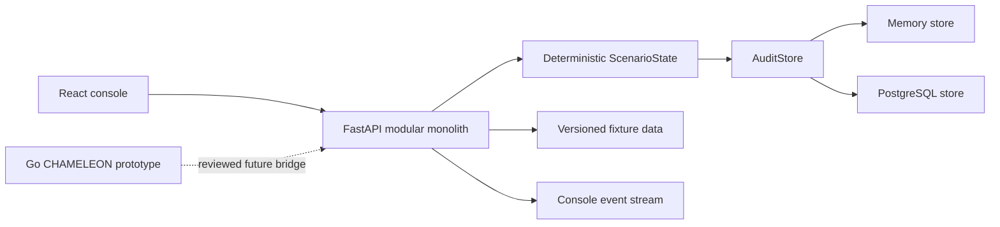

# Ghost Fabric Architecture Guide

## System boundary

Ghost Fabric is a simulation-first resilience demonstrator. All scenarios use
synthetic or approved training data. The architecture intentionally excludes
targeting, individual profiling, operational deception, and external recovery
execution.

## Components

| Area | Location | Responsibility |
|---|---|---|
| REST/API | `backend/app/main.py` | Versioned REST, WebSocket console stream, deterministic scenario state |
| Authentication | `backend/app/auth.py` | Bearer token, JWT, API-key principal resolution and RBAC |
| Audit | `backend/app/audit/` | Append-only event persistence and command idempotency |
| CHAMELEON | `services/chameleon-control-plane/` | In-process Raft/mesh prototype; no external transport |
| PROPHET | `backend/app/ai_adapter.py` and fixtures | Schema-constrained review explanation with fixture fallback |
| MIRROR | `backend/app/mirror_*.py` | Fixture-only tabletop DSL, catalog APIs, replay, virtual time, audit trace |
| PHOENIX | `backend/app/phoenix_workflow.py` | Simulation-only stepped approval/execute/verify/rollback state machine |
| Demo pacing | `backend/app/demo_phases.py` | Derived fictional exercise phases for console guidance |
| Console | `frontend/src/` | Guided four-layer React console with `/api/v1` clients |

## Event and audit flow

Every mutation appends a versioned `EventEnvelope` with:

- correlation ID and monotonic sequence;
- source, event type, severity, and payload;
- a chained event hash; and
- authenticated actor/role when provided.

`AuditStore` persists that event and the current deterministic snapshot.
`X-Command-ID` records mutation results so a retry receives the original
result. CHAMELEON and MIRROR evidence must map into this canonical trail rather
than establish a parallel log.

## Security and approval boundaries

- `viewer` can read state and exports; `operator` can mutate simulation state.
- JWT, configured bearer tokens, and configured API keys authenticate REST
  callers. Raw credentials are not written to audit events or logs.
- PHOENIX requires explicit operator approval before its simulated execution
  state. Failed verification requires rollback.
- CHAMELEON control-plane transport, node identity, and cross-region work
  remain review-gated; the Go prototype cannot approve PHOENIX recovery.

## Deployment shape

Local development uses in-memory audit storage. Docker Compose adds PostgreSQL,
FastAPI, nginx, and the console. The AWS pilot creates three independent
regional footprints; it does not implement cross-region consensus or failover.

See [DEPLOYMENT.md](DEPLOYMENT.md) for operations and
[architecture/](architecture/) for focused decision records.
