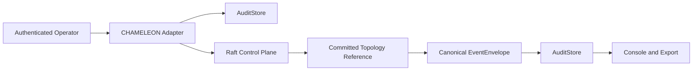

# CHAMELEON Control-Plane Audit Integration — GF-33

**Status:** Prototype contract  
**Scope:** The in-process Go prototype in
`services/chameleon-control-plane/`  
**Excluded:** External transport, browser subscriptions, direct recovery
automation, and cross-region replication

## Purpose

CHAMELEON consensus commits a topology-control reference. It must not become a
second event store or an authority for PHOENIX recovery.

The FastAPI application is currently the source of canonical
`EventEnvelope` records and persists them through `AuditStore`. The future
CHAMELEON service consumes or publishes only references compatible with that
contract.

## Contract

Before submitting a control entry:

1. The calling adapter validates an authenticated actor and role.
2. The adapter creates or obtains an existing canonical `EventEnvelope`.
3. The envelope is persisted through `AuditStore`.
4. The adapter supplies `correlation_id`, canonical payload bytes, and
   `audit_event_ref` to CHAMELEON.

After quorum commit:

1. CHAMELEON reports `term`, `index`, `payload_hash`, and `audit_event_ref`.
2. The adapter appends one canonical event such as
   `chameleon.topology_revision_committed`.
3. `AuditStore` persists that event with the actor/role and prior audit hash.
4. Consumers receive the canonical event stream — not an unaudited Raft log.



## Prohibited paths

- A consensus entry must not contain a recovery route, command payload, or
  token that can cause an external action.
- A committed entry must not bypass authenticated `operator` authorization.
- A Raft leader must not call `/api/recovery/approve`.
- No client should treat leader election as human approval.
- Raft compaction must not delete or rewrite `AuditStore` evidence.

## Implemented in-process adapter

`services/chameleon-control-plane/audit_adapter.go` now defines a narrow Go
`AuditEventSink` boundary that mirrors the backend `EventEnvelope` fields.
`TopologyAuditAdapter` emits the following canonical sequence:

```text
topology_revision_requested
        -> topology reference committed by quorum with requested event ID
        -> topology_revision_committed
```

No-quorum writes produce `topology_revision_rejected` after their requested
event. The in-memory sink exists only for fixture/contract tests. It is not a
parallel production audit store: a future reviewed process boundary must map
the sink to the FastAPI `AuditStore`.

## Backend canonical bridge

`backend/app/chameleon_bridge.py` is the only transport-free backend ingress
for `ChameleonTopologyCommit` evidence. It requires:

1. an authenticated `operator`,
2. the active scenario's correlation ID,
3. a topology payload hash and prior requested-event reference, and
4. a server-generated canonical `EventEnvelope` hash persisted via
   `ScenarioState._append_event` and `AuditStore`.

It deliberately exposes no HTTP route. A future reviewed process boundary
must authenticate its own node identity and call this bridge rather than
writing audit records directly.

The proposed versioned evidence shape lives in
`contracts/chameleon-topology-commit.schema.json`; review requirements are in
`docs/architecture/CHAMELEON_TRANSPORT_REVIEW.md`.

The existing Python API and WebSocket contract remain unchanged until GF-34
introduces a reviewed topology subscription protocol.

## Acceptance checks for the next slice

- A three-voter in-process test proves leader election and quorum commit.
- A leader crash elects a replacement; recovering follower catches up.
- No-quorum write is rejected and recorded as degraded/read-only.
- Recovery approval attempt is rejected by design.
- Every committed revision references the existing audit chain.
