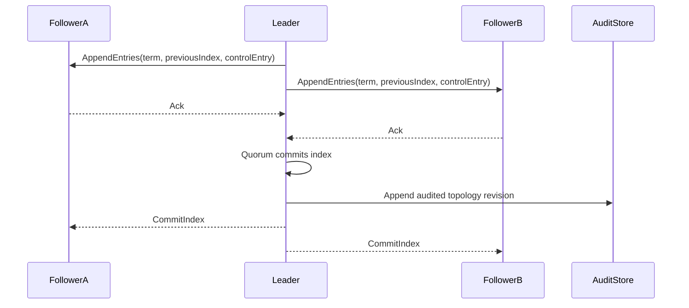

# CHAMELEON Consensus Decision — GF-32

**Status:** Proposed Raft design complete; Principal Architect / security sign-off required before transport  
**Scope:** Fictional, simulation-first control-plane coordination for a 20–50 node CHAMELEON mesh  
**Non-goal:** Autonomous recovery, production military operation, or cross-region failover implementation

## Decision

Use **Raft** for the first CHAMELEON consensus implementation.

Raft coordinates only the replicated control-plane state required to present one
consistent mesh view:

- membership and node health observations,
- elected coordinator identity and epoch,
- topology/route revision,
- declared degraded-mode level, and
- references to immutable audit events.

Raft does **not** execute PHOENIX recovery, select a route, or authorize an
external action. The existing operator approval requirement remains outside
the consensus mechanism.

## Why Raft

| Option | Crash fault model | Byzantine fault model | Normal-case messages | Decision |
|---|---:|---:|---:|---|
| Raft | Tolerates `f` crash/omission faults with `2f + 1` voters | None | Leader → followers; quorum acknowledgement | Selected |
| PBFT-class protocol | Also tolerates crash faults | Tolerates `f` Byzantine nodes with `3f + 1` replicas | Quadratic prepare/commit phases | Deferred |

The current product has a deterministic simulator, one canonical event
envelope, durable audit, and operator-gated mutations. It does **not** have a
validated Byzantine threat model, hardware roots of trust, signed node
attestation, or a performance budget proven for PBFT-class coordination.

Selecting PBFT now would imply tolerance that the platform cannot yet prove.
The initial assumption is therefore **0 Byzantine tolerance**: a node that
lies, forges identity, or equivocates is an incident requiring isolation and
human review, not a consensus-success condition.

If a future approved threat model requires Byzantine tolerance, create a
separate ADR and prototype with `3f + 1` replicas; do not silently reinterpret
Raft as Byzantine-safe.

## Cluster shape and quorum

| Deployment stage | Voters | Crash faults tolerated | Notes |
|---|---:|---:|---|
| In-process integration test | 3 | 1 | Required before service extraction |
| Pilot regional cluster | 3 | 1 | One AWS region; separate failure domains where possible |
| Expanded regional mesh | 5 | 2 | Use after measured load/chaos evidence |

Observers may receive topology updates but never vote. Never use an even voter
count. Cross-region AWS footprints from GF-29 remain independent pilots until
GF-47 defines and tests cross-region replication.

## Replicated state contract

Each committed Raft entry carries a versioned `ChameleonControlEntry`:

```json
{
  "schema_version": 1,
  "cluster_id": "regional-pilot-id",
  "term": 42,
  "index": 812,
  "correlation_id": "run_...",
  "entry_type": "topology.revision",
  "actor": "system-or-authenticated-subject",
  "payload_hash": "sha256...",
  "audit_event_ref": "evt_...",
  "committed_at": "server-generated RFC3339 timestamp"
}
```

Rules:

1. The entry contains a canonical payload hash, not an uncontrolled command.
2. `correlation_id`, actor, role, and the canonical payload must remain
   traceable to the existing `EventEnvelope` and `AuditStore`.
3. State-machine application is deterministic and idempotent by
   `(cluster_id, term, index)`.
4. A committed control entry may update topology state and emit a local audit
   event; it may not perform a consequential recovery action.
5. PHOENIX approval remains an authenticated `operator` action with explicit
   human confirmation. Raft may replicate the approved record after that
   approval, never substitute for it.

## Election and heartbeat design

Initial values are **starting defaults, not latency claims**:

| Setting | Initial value | Rationale |
|---|---:|---|
| Heartbeat interval | 250 ms | Enough observations without excessive control traffic |
| Election timeout | randomized 1,500–3,000 ms | More than 5× heartbeat to reduce false elections |
| Leader lease | Not used for writes | Quorum commit remains authority |
| Read consistency | Leader/quorum for control state | Followers may serve explicitly stale diagnostic reads |
| Client retry | Exponential backoff with jitter | Reuse command idempotency key |

Tune only after a controlled 3/5-node benchmark and failure-injection report.
Do not advertise failover or route-recalculation latency until measured in the
intended environment.



## Replication, snapshots, and recovery

1. Leader appends an entry locally, replicates it, then commits after a quorum
   acknowledgement.
2. Followers reject entries with an invalid previous index/term and converge
   through Raft backtracking.
3. Take a compacted state-machine snapshot after a reviewed entry-count or
   log-size threshold; retain immutable audit exports independently.
4. Snapshot manifests include schema version, last included index/term,
   canonical state hash, fixture/version provenance, and audit-chain head.
5. Joining nodes receive a verified snapshot plus subsequent log entries.
6. A node restores to **read-only/degraded** state if snapshot validation or
   audit correlation fails.

Raft log compaction does not delete the durable audit source of truth.
`AuditStore` remains the external, append-only decision evidence; Raft is the
replicated control-state mechanism.

## Failure and degraded-mode behavior

| Condition | CHAMELEON action | Human/PHOENIX action |
|---|---|---|
| Leader crash | Elect a new leader after timeout/quorum | None automatically |
| Quorum unavailable | Freeze control-plane writes; serve labeled stale/read-only topology | Operator follows runbook; no recovery auto-approved |
| Network partition | Minority partition cannot commit; remains read-only/degraded | Human decides whether to operate locally |
| Invalid/forged node message | Reject, audit, isolate candidate node | Security/operator review |
| Audit store unavailable | Refuse new committed control writes | Preserve fixture/degraded view; no invented state |

## Implementation boundary (GF-33)

GF-33 should introduce a dedicated Go or Rust CHAMELEON control-plane service
behind a narrow transport interface. It should not put Raft logic into
`backend/app/main.py`.

Required first slice:

1. Three in-process voters and a deterministic fake clock/transport.
   A 10-node harness (5 voters + 5 observers) now supplements this baseline.
2. Membership, leader, topology revision, and degraded-mode state machine.
3. Adapter that publishes committed revisions as the existing versioned event
   envelope and durable audit reference.
4. Tests for election, leader crash, stale follower catch-up, no-quorum write
   rejection, idempotent replay, and snapshot restore.
5. Measured benchmark report before any latency/throughput claims. See
   `services/chameleon-control-plane/BENCHMARK_RESULTS.md`; it is explicitly
   an in-process developer baseline, not a product claim.
6. Mesh-core slice (health scoring, route recalculation, feature shedding):
   see `services/chameleon-control-plane/MESH_CORE.md`. Route timing logs are
   fixture-labeled observations only; Notion `<500ms` / throughput targets
   remain unproven product claims.
7. Deterministic chaos fixtures (crash/partition/validation rejection):
   see `services/chameleon-control-plane/CHAOS_TESTING.md`. Byzantine
   tolerance and wall-clock `<1min` recovery criteria remain out of scope
   until threat-model and transport reviews approve them.

## Approval gates

- Principal Architect reviews Raft selection, timeouts, snapshot lifecycle,
  and deployment fault domains.
- Security review validates node identity, transport encryption, and
  certificate rotation design before nodes communicate outside an in-process
  test harness.
- Product/safety review verifies Raft only coordinates state and cannot
  authorize a PHOENIX recovery or any operational action.

## Acceptance mapping

- Raft vs PBFT trade-offs: documented above.
- Leader election / heartbeat tuning: proposed defaults documented above.
- Log replication + snapshots: contract and lifecycle documented above.
- Byzantine assumption: Raft has 0 Byzantine tolerance; `N/3` applies only to
  a future PBFT-class design with `3f + 1` voters.
- Principal Architect approval: **pending**.
